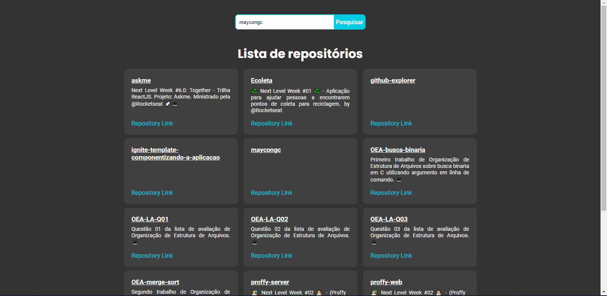

<h1 align="center">
  GitHub Explorer
</h1>

  

 

## Sobre o Projeto

Um projeto simples com o objetivo de consumir a API do GitHub para listar os repositórios dos usuários que digitado.

 

## 🚀 Tecnologias Utilizadas

- [Node.js](https://nodejs.org/en)
- [TypeScript](https://www.typescriptlang.org)
- [ReactJS](https://reactjs.org)
- [Styled Components](https://styled-components.com/docs)

 

## 🎨 Layout preview

<!-- 🏗️👷‍♂️🚧⚠️ Em construção...⚠️🚧👷‍♂️🏗️ -->

 

## ✅ Feature

- **[ done ]** Listar os repositórios da API do GitHub do usuário digitado

 

 

# 😯 Como contribuir para o projeto

1. Faça um Fork do projeto
   Crie uma Branch para sua Feature (git checkout -b feature/FeatureIncrivel)
2. Adicione suas mudanças (git add .)
3. Comite suas mudanças (git commit -m 'Adicionando uma Feature incrível!)
4. Faça o Push da Branch (git push origin feature/FeatureIncrivel)
5. Abra uma Pull Request

> Caso tenha alguma dúvida confira este [guia de como contribuir no GitHub](https://github.com/firstcontributions/first-contributions)

---

<h4 align="center">
    Feito com 💜 por Maycon Gorgonha 👋🏽 <a href="https://www.linkedin.com/in/maycon-gorgonha/" target="_blank">Entre em contato!</a>
<h4>

MIT License © <a href="https://github.com/maycongc">Maycon Gorgonha</a>

